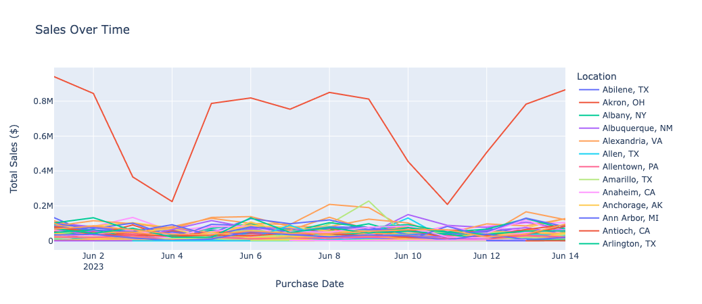
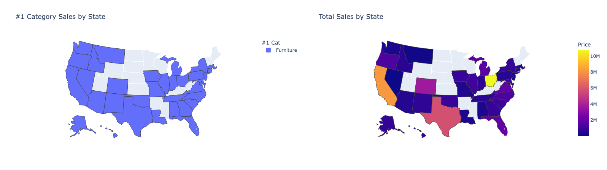
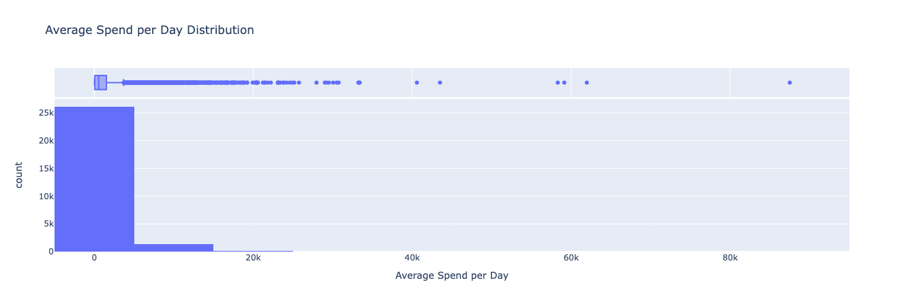
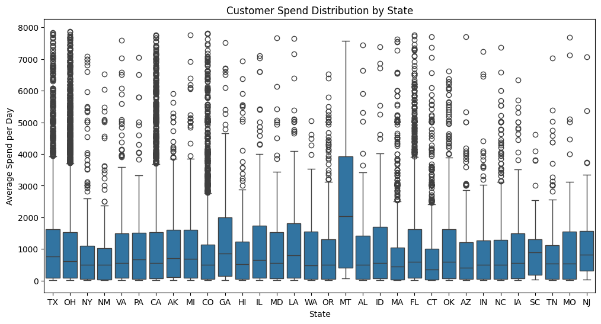
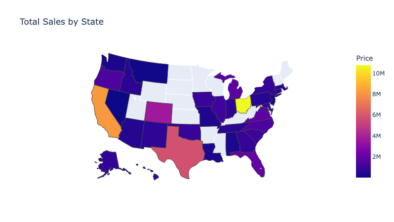

Hello Evan,

You'll find the requested emails below on this email, as well as my jupyter notebook attached.  My apologies for a few minutes of tardiness, I only got a chance to look at this late this afternoon.

As well as a google drive repo with the relevant files linked in addition to what is attached here.

> [LSDirect-DataAnalyst-Task](https://drive.google.com/drive/folders/10v34KXHUvLk7mbItdqqh8gZ2bxAPUIt8)

Looking forward to your review as well as next steps.

Best regards,
Alex Oswald

## EMAIL TO TEAM

Hey Team,

I completed some preliminary EDA into the sales from `COMPANY_NAME` for 2023-06-01 to 2023-06-14.  I combined the `products.csv`, `stores.csv`, `transactions.csv` into one `ALL_DATA.parquet` file in the ZIP attached.

Upon looking into the Sales by state on a category & net-earnings basis... Furniture was by far the leading category for every agg'd state (some contain multiple stores e.g. Ohio & Texas).

Regarding outliers:  The Nevada Store is the only one that doesn't sell all four categories of products. For this period they are missing any records on Footwear sales, although they are also the lowest grossing store overall, so I'm not sure what the status is over there.  I've mentioned this in my report to them.

I also looked into their customer distribution & return-to-store rates.  The vast majority only returned once, but there most definitely some outliers in terms of spend as seen here on this dist/box chart.

Show here is the Average spend Per Customer Per Day. We have no TransactionID field, so if we want something more granular we should look into collecting that.

THOUGHTS FOR IMPROVEMENT:

- I think a visualization gif of avg transaction-price per store over time could be insightful given a longer time period of data to show any growth or easily-identifiable slackers ++ the clients would find it easy to read.  A table of flagged stores and the metrics of their losses/gains would be helpful to accompany.
- Look more into specific category-leading & -lagging products.
- Segment customers into (top X% of trips to store, top X% of spender, or purchase-archetype) before conducting analysis so we can target groups of interest.

Perhaps we can discuss next steps at the daily standup tomorrow.

—Alex

---

## EMAIL TO CLIENT

Hello `CLIENT_NAME`,

We've conducted some preliminary analysis on the sales at your store locations from 01 June - 14 June 2023 at all of your stores across the country.

As you know, Furniture is a leading category at all of your stores. However, the store in Enterprise, NV (197) had no Footwear sales over the provided period just so you're aware.

You'll find below the top performing stores by City, led by Akron, OH with a large margin.

Regarding Sales per-state, Ohio, California, and Texas are by far the best performing.  Let us know if we should focus on those stores in the future, or leave them be as they are succeeding.

And finally, some insight into the average spend per customer per day for each state.  This has the highest spenders removed for readability purposes.

You'll find that the blue box represents the average 50% of customers, and the line in the middle is their median.  The "whiskers" that extend beyond the blue box show the limits of min & max purchases, while the circles are outlier high-spenders.

Do let us know if there's anything we can best assist you with.  And we'll reach back to you shortly.

Best regards,
Alex O. @ LS Direct

`INSERT_COMPANY_EMAIL_SIGNATURE`
